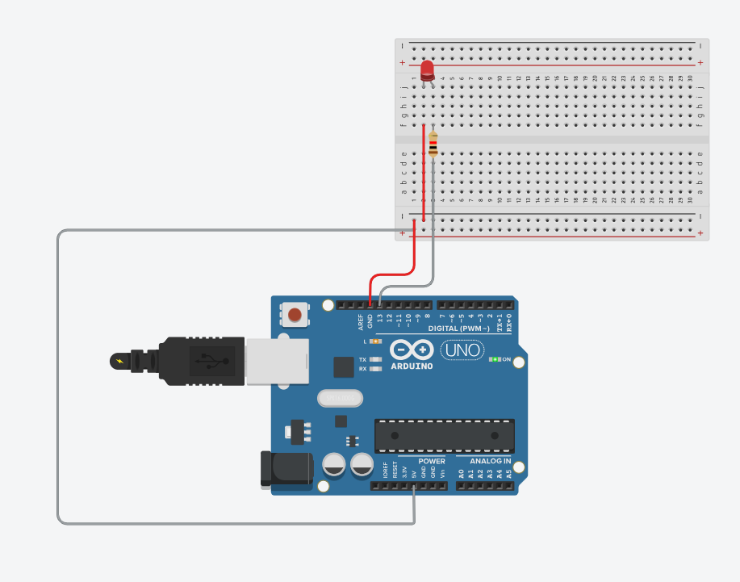

# 🔴 LED Piscante com Arduino

Projeto básico utilizando Arduino para controlar um LED piscante em linguagem C++.

## 🧠 Descrição

Este projeto demonstra o funcionamento de uma saída digital do Arduino, fazendo com que um LED conectado ao pino 13 pisque em intervalos regulares de 1 segundo.

## 🎯 Objetivo

O objetivo deste projeto é introduzir conceitos iniciais de eletrônica e programação com Arduino, como:

- Controle de pinos digitais
- Estrutura básica de um programa Arduino (`setup` e `loop`)
- Uso de temporização com delay

## 🔌 Componentes utilizados

- Arduino Uno
- LED
- Resistor (220Ω)
- Jumpers
- Protoboard

## 🔧 Montagem do circuito 

1. Conecte o LED no pino 13 (ânodo/+)
2. Coloque o resistor de 220Ω em série com o LED
3. Conecte o cátodo (-) ao GND  

## ⚙️ Funcionamento

O Arduino envia sinal elétrico para o LED, alternando entre ligado e desligado a cada 1 segundo, criando um efeito de piscar contínuo.

## 🔌 Circuito

